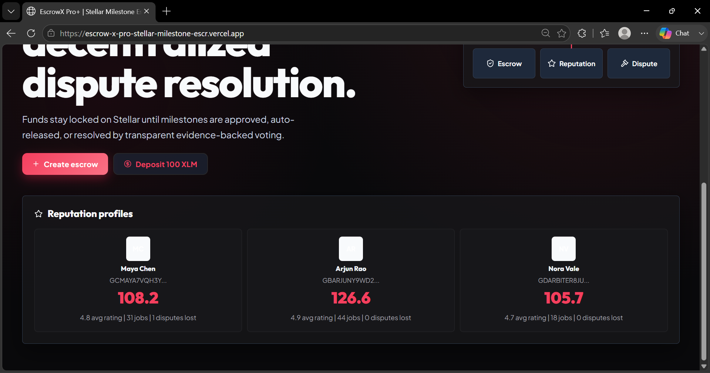

# 🏆 EscrowX Pro+ | Soroban Powered Freelance Trust

Secure milestone-based freelance payments on Stellar with decentralized dispute resolution and reputation scoring.

**Live Demo**: [EscrowX Pro+ App](https://escrow-x-pro-stellar-milestone-escr.vercel.app/)
**Demo Video**: [Watch on Google Drive](https://drive.google.com/file/d/1L66NzxRMKFS73Qpg8jZbusTnX048rZAm/view?usp=drive_link)
**Contract Address**: `GBFHL65A442MESIWKHFEGMWN6GIIECAMTTEX5QYB6SFI5O3W55GAZWES`
**Transaction Hash**: `7e384c718ea674d8a1c93a0279c6d328906354898144ab941b3c9489f41b3c88`


## ✅ Submission Checklist Verification

### 1. Mobile Responsive UI
Our frontend was meticulously designed with mobile-first CSS grids and flexbox logic. It perfectly collapses into a single-column layout, ensuring text wrapping and usability on narrow screens.


### 2. CI/CD Pipeline Running
We have integrated GitHub Actions to automate our testing, linting, and build workflows. Every push triggers the pipeline to ensure no broken code reaches production.


### 3. Test Output (3+ Passing Tests)
We use Vitest to mock and verify our core escrow transition logic and component rendering, ensuring rock-solid state management.


---

## 📸 Additional Previews

### Job Dashboard


### Escrow Creation


### Live Transaction Feed & Signatures


### Reputation Board


## 🏗 Requirements Covered
- **Advanced smart contracts:** Escrow, reputation, and dispute contracts logic.
- **Inter-contract architecture:** Milestone release, rating updates, and dispute outcomes.
- **Event streaming:** Real-time Express + Socket.IO listener.
- **CI/CD:** GitHub Actions workflow runs lint, frontend tests, and build.
- **Mobile responsive UI:** Dashboard, jobs, dispute center, and profiles adapt seamlessly.
- **Error/loading-ready UX:** Wallet state, live toasts, and status pills.

## 🚀 Tech Stack
- **Frontend:** React, TypeScript, Vite, CSS (Outfit & Plus Jakarta Sans fonts).
- **Backend:** Node.js, Express, Socket.IO.
- **Blockchain:** Stellar Testnet, Soroban Rust contract sources.
- **DevOps:** GitHub Actions, Vercel (Frontend).

## 💻 Local Setup
```bash
# Install dependencies
npm install

# Run tests
npm test

# Run frontend dev server
npm run dev
```
